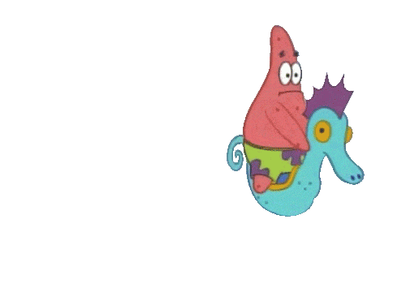

## <p align="center">Hey, I'm Nikhil! Great to see you here.</p>

### <p align="center">  &nbsp; OpenSource Enthusiast 💚&nbsp; | &nbsp; Full-Stack Enthusiast 👨‍💻 &nbsp;  </p>

##

<p></p>

```js
private static int updateDesktop (Image wallpaper) {
int happiness;
MyDesktop desktop = new MyDesktop();
desktop.apply (wallpaper); happiness = INFINITY;
return happiness;
}
```
<p align="left">  </p>

<br>

## 📈 Github Stats

<table>
<tr>
<td>

<td>
</td>
</tr>
</table>
<p align="center">

</p>

   ##

<p align="center">Feel free reaching out to me at following platforms:</p>

<p align="center"> 
  <a href="https://twitter.com/404Nikhil"></a>
  <a href="mailto:nicksd111@gmail.com" target="_blank"></a>
</p>


  </div>

 
   
   

